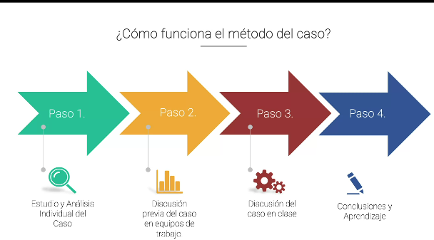

03/12/2024

Se deben realizar todos los apuntes del caso y se debe de analizar personalmente

## Principios de diseño de arquitectura 
Qué es la arquitectura de software?
Es la organizacion fundamental de un sistema descrito en sus componentes, relacion entre ellos y con el ambiente, principios que guían su diseño y evolución.
Abarcan los componentes de software y sus relaciones.

Orientacion al dominio = orientacion al negocio de la app.

En la arquitectura de software tambien se deben tener en cuentael ambiente fisico (hardware) en el cual estará la aplicacion, ya que usualmente es un punto el cual descuidamos bastante.

## Arquitecturas
### Arquitectura 4+1
**Vista 4+1 (escenarios):** Esta vista es representada por los casos de uso que ayudaran a aunir las otras 4 vistas,diagramas UML -> Diagramas de caso de usos. 
**Vista de Procesos:** Representa los flujos de trabajo (de negocio) paso a paso, muestra algunos requisitos no funcionales como ejecucion, tolerancia a fallas, integridad, seguridad, etc. 
Se basa en los procesos de negocio. 
UML -> Diagrama de actividad.
**Vista lógica:** Requisitos del sistema y lo que el sistema debe hacer, enfocada en clases y objetos principales que funcionan como el core de la app.
UML -> Diagrama de Clases, Diagrama de Paquetes.
**Vista de despiegue:** Muestra el sistema en componentes y como dependen entre si. Muestra archivos físicos, cabeceras, libs, modulos, exec, paquetes, etc. Como dependen y se comunican entre ellos. 
UML -> Diagrama de componentes, Diagrama de paquetes.
**Vista fisica:** Representa la distribucion de los componentes y servicios que conforman la solución. La vista logica se mapea a componentes de hw. 
UML -> Diagrama de deployment.

## Ingeniería de requerimientos
Como se determinan los requerimientos? Se debe encontrar el problema y entenderlo