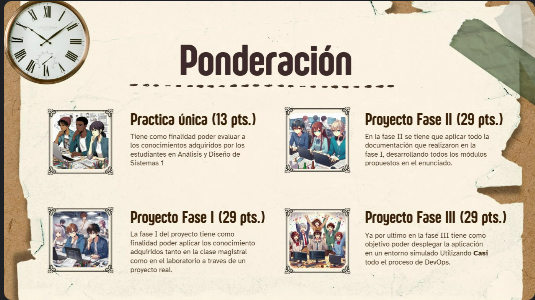
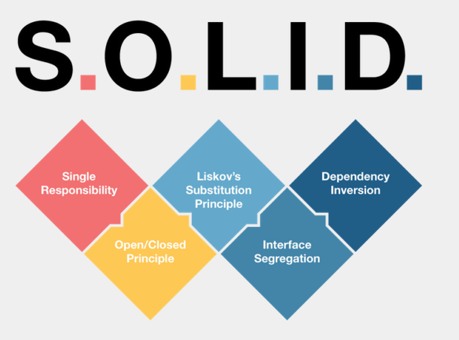
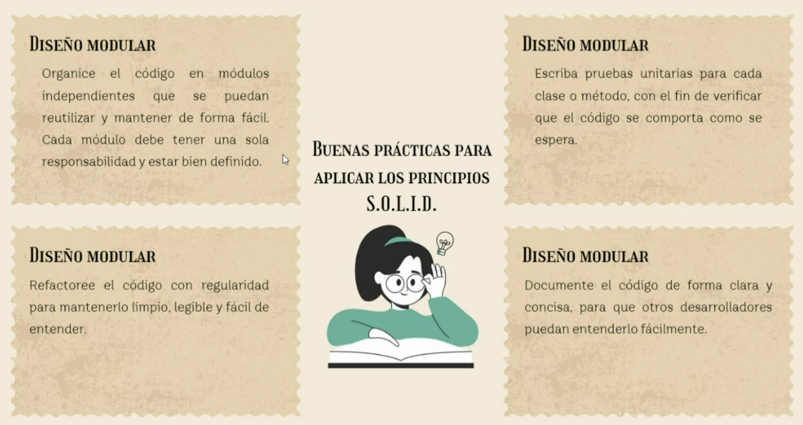

03/12/2024
# Introduccion

## Frameworks
Que son los frameworks? los frameworks son plantillas o conjuntos de herramientas y bibliotecas que sirven para estandarizar trabajo.

Creados entre 1980 y 1990 como un conjunto de bibliotecas.
No todos los frameworks son compatibles para todos los modelos de negocio, ya que ofrecen distintas caracteristicas.

## Principios SOLID 

S -> Single responsability, el código (las clases) deben estar segregadas y tener las funcionalidades bien definidas 
O -> Open Close Principle, se define codigo que es abierto a la extension pero cerrado a la modificación
L -> Liskov Substitution, las subclases deben se sustituibles sin que se afecte la estructura del programa, es decir que las clases hijos puedan aplicarse en las clases padres sin ninguna complicacion. 
I ->Interface Segregation, establece que las clases no deben depender de interfaces que no utilizan. 
Este principio se basa en la idea de que las interfaces deben ser pequeñas y específicas, de manera que cada clase solo implemente los métodos que necesita.
D -> Dependency inversion, Modulos de alto nivel no deben de depende de modulos de bajo nivel, ambas deben depender de abstracciones, los modylos deben ser menos dependientes entre si, deben tener independencia debil.

## Patrones de diseño
Se debe entender el problema, conocer los distintos patrones de diseño y evaluar y adaptar los patrones para la necesidad del proyecto

## Patrones de diseño creacionales 
### Singleton
Garantiza que las clases tengan una instancia unica en todo el sistema. Se proporciona un punto de acceso global hacia la instancia. 
### Abstract factory
Se debe de crear una clase abstracta antes y luego se replica y se modifica (?) Puede compararse a la reutilizacion de los componentes en react.
